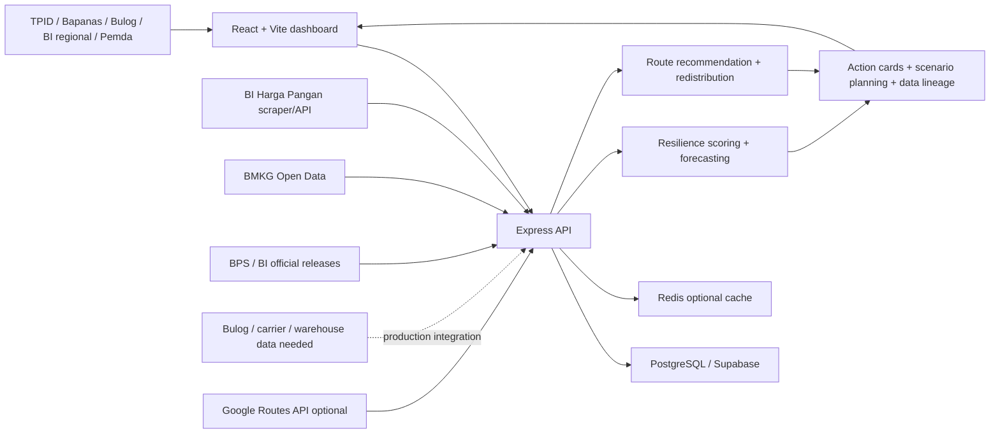

# Submission Supporting Evidence

Dokumen ini bisa dijadikan bahan lampiran atau appendix untuk proposal. Isinya
menjawab tiga hal yang biasanya dicari juri: bukti masalah, bukti solusi, dan
bukti kesiapan bisnis/teknis.

## Architecture

## Data Source Matrix

| Dataset | Current Status | Source | How Prototype Uses It | Production Requirement |
|---|---|---|---|---|
| Inflation and macro | official-release | BPS and BI releases | Rupiah risk, volatile food context, scenario narrative | Periodic official update ingestion |
| Weather forecast | real-time capable | BMKG Open Data | Harvest risk and weather alert | adm4 mapping for all target regions |
| Food prices | real-time capable | BI Harga Pangan scraper/API; Bapanas Panel Harga when stable | Commodity price monitoring and anomaly input | Stable endpoint access and source logging |
| Supply-demand | forecast / seed for MVP | Prototype seed; expected Bapanas/Bulog/Dinas data | Surplus-deficit simulation | production_ton, stock_ton, demand_ton, warehouse_id |
| Logistics ETA/distance | real-time capable when key exists | Google Routes API | Road ETA and distance for eligible routes | Google key and road-routable origin/destination |
| Logistics cost/capacity | forecast / unavailable | Prototype route table | Route score and optimization demo | carrier, capacity_ton, cost_per_ton, lead_time_days |
| Resilience score | forecast | Kepang AI model | Decision cockpit and shock scenario | Validation against historical interventions |

## Impact KPI

| KPI | MVP Target | Measurement Method |
|---|---:|---|
| Time to identify priority region | Under 3 minutes | User task test with TPID/dinas pangan persona |
| Time-to-insight reduction | 50% vs manual baseline | Compare dashboard task vs spreadsheet/manual workflow |
| Simulated supply gap reduction | At least 30% for selected deficit region | Before-after redistribution scenario |
| Logistics cost potential | 5-10% after route validation | Cost per ton before-after optimization |
| Data lineage completeness | 100% of displayed datasets labelled | Audit UI and API response |
| Source freshness coverage | 80% for connected public sources | Timestamp checks on BI/BMKG/BPS/BI feeds |
| Recommendation validation | 5-10 stakeholder interviews | Structured interview scorecard |

## Business Model

| Revenue Stream | Buyer | Value Sold |
|---|---|---|
| Annual institutional license | Pemda, TPID, Bapanas, Bulog, BI regional | Dashboard, user seats, modules, regional coverage |
| Implementation fee | Pilot institution | Setup, data integration, training, custom workflow |
| Managed analytics | Government or enterprise partner | Monthly risk report and scenario briefing |
| API subscription | Institutions, logistics, finance, insurance | Risk score, anomaly signal, route intelligence |
| Logistics add-on | Carrier, warehouse, commodity aggregator | Route optimization, backhaul, capacity matching |
| Grant / innovation funding | Public program, CSR, donor | Early pilot, validation, and social impact deployment |

## Guidebook Evidence Map

| Guidebook Question | Evidence to Attach |
|---|---|
| Problem Validation | BPS/BI/Bapanas source links and problem-market fit notes |
| Solution Approach | Resilience Room screenshot and architecture diagram |
| Impact Scale & Targets | KPI table and rollout path 6 regions -> 34 provinces -> 514 kab/kota |
| Innovation | Data lineage screenshot, scenario shock, and logistics recommendation |
| Technical Quality | API list, schema, scraper service, testing notes |
| Business Model | Revenue stream, cost structure, and partnership model |
| Progress | Prototype status, Supabase integration, backend/frontend modules |

## Attachment Package

Recommended PDF contents:

1. One-page problem and solution summary.
2. Three screenshots: Resilience Room, Logistics, Evidence Room.
3. Architecture diagram.
4. Data source matrix.
5. Impact KPI and business model table.
6. Test report and current limitations.
7. Interview plan for next validation stage.

## Remaining Evidence To Collect

- Team ID, final team composition, and official proposal title.
- 5-10 structured user interviews with TPID, dinas pangan, Bulog, BI regional, or logistics operators.
- Screenshot after Google Maps key is configured, if available.
- Production data-sharing interest letter or pilot MoU, if possible.
- Short demo video with voice-over: problem -> scenario shock -> action recommendation -> data lineage.
